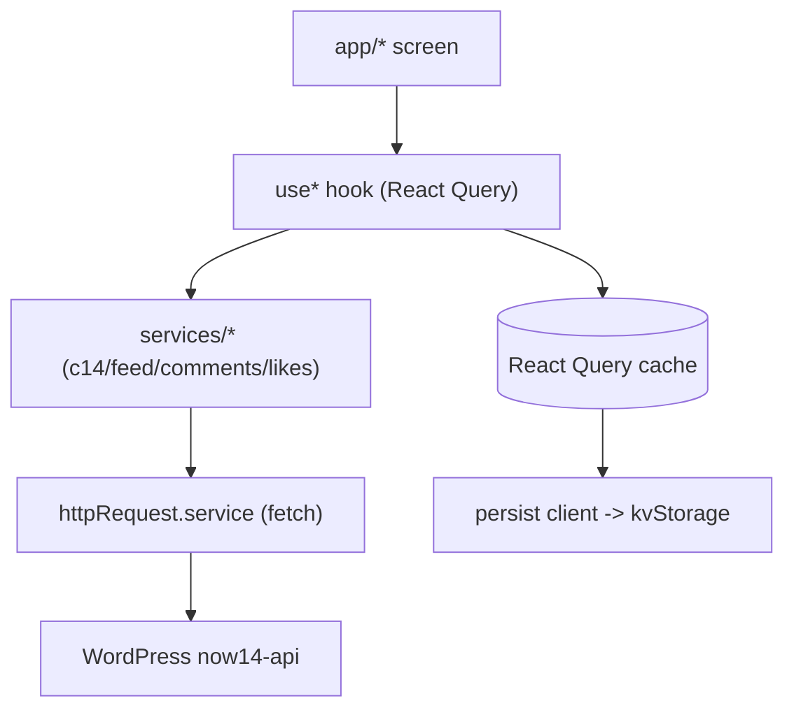

# Architecture

## Runtime / tooling

| Concern        | Choice                                  |
| -------------- | --------------------------------------- |
| Framework      | Expo SDK **54** (`expo@~54.0.0`)        |
| Runtime        | React Native 0.81.5, React 19.1         |
| Router         | `expo-router` v6 (file-based, typed)    |
| Styling        | NativeWind v4 + design tokens (`src/theme/tokens.ts`) |
| Data fetching  | `@tanstack/react-query` v5              |
| Fonts          | SimonaPro (brand font, 4 weights)       |

> Note: `AGENTS.md` and the Cursor rule reference Expo **v56** docs, but the
> project actually runs on Expo **SDK 54**. All native APIs in this codebase are
> validated against the v54 docs (`https://docs.expo.dev/versions/v54.0.0/`).

## Folder layout

```
src/
  app/            # expo-router screens (thin: fetch + compose)
  components/
    ui/           # generic primitives (AppText, AppImage, AppFlatList, ...)
    Article/      # article + home article layouts (mirrors web)
    Home/         # home renderer + feed
    Layout/       # Header, BottomNav, MobileNav, MobileNavShell
    Skeletons/    # loading placeholders
    archive/      # category (archive) screen + feed
  hooks/          # data + device hooks (useArticle, useArchive, useNetworkStatus, ...)
  services/       # API layer (httpRequest + c14 + feed + comments + likes)
  lib/            # cross-cutting infra (storage, query persistence)
  contexts/       # React contexts (Article, Layout, MobileNav)
  providers/      # app-wide providers (QueryProvider)
  types/          # shared API contracts (ported from web)
  utils/          # html parsing, navigation, request origin
  theme/          # design tokens + typography
```

## Data flow



Screens stay thin: they fetch via hooks and compose components. Repeated data
logic lives in `hooks/`, repeated UI in `components/`.

## Offline + caching (Phase 0)

Goal: previously-viewed content stays available offline, and the user gets a
clear indicator when the network is down.

- **Network detection**: `expo-network`'s `useNetworkState()` (bundled in Expo
  Go) powers `useNetworkStatus()` and the global `OfflineBanner`. This is the
  Expo-native equivalent of `@react-native-community/netinfo` and works without
  a custom dev build.
- **Cache persistence**: React Query's cache is persisted through
  `PersistQueryClientProvider` + `createAsyncStoragePersister`, backed by the
  `kvStorage` abstraction in `src/lib/storage.ts`.
- **Storage backend** (`src/lib/storage.ts`): prefers **MMKV**
  (`react-native-mmkv`) when its native module is available (i.e. a custom dev
  client / production build), and transparently falls back to **AsyncStorage**
  when it is not (e.g. Expo Go). Calling code only sees an async
  `getItem/setItem/removeItem` interface, so the backend can change without
  touching consumers.

### Why not Redis?

Redis is a server-side store and cannot run inside a mobile app. The native
equivalent of "a fast cache that survives restarts" is MMKV/AsyncStorage plus
React Query persistence, which is what this app uses.

### MMKV requires a dev build

`react-native-mmkv` ships native code and is **not** available in Expo Go. Until
a custom dev client is built, the app automatically uses AsyncStorage. No code
change is needed to switch: building a dev client makes `kvStorage` pick MMKV up
on its own.

## Navigation

- `expo-router` Stack with `headerShown: false`; the app draws its own
  `Header` + `BottomNav`.
- In-app routes: `/` (home), `/article/{id}`, `/archive/{id}`.
- The "מדורים" mega-menu and category links push to `/archive/{id}` in-app
  (previously they opened the website in an external browser).

## RTL

The product is Hebrew/RTL. `AppText` defaults to `textAlign: "right"` and
`writingDirection: "rtl"`. Visual row order is set explicitly with
`flex-row-reverse` rather than relying solely on `I18nManager`.
